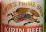

# yolov5_Beer_Logo_Detection

ビールメーカーのロゴ(キリンとアサヒのみ)をYOLOv5を使用して検出するWebアプリです。

キリンビールのロゴは麒麟を、アサヒビールはAsahiを検出します。

### インストールが必要なライブラリについて
requirements.txtに記載されているyolov5を実行するのに必要なライブラリとFlaskが必要です。

### 学習用データセットについて
YOLOv5自体に学習時にalbumentationsを使った画像水増しがありますが、ローカルで水増しを行いました。

albumentationsを使って、４倍(65枚→260枚)に画像を水増ししています(回転(RandomRotate)と切り出し(RandomSizedCrop))

また、全体の画像の40％に対してGridMaskを行っています。(01.training_dataset参照)

なお、学習用の画像サイズは640*640にリサイズしています。

### モデルについて
YOLOv5sをベースに学習させたモデルがbest_beer_yolov5s.pt

YOLOv5mをベースに学習させたモデルがbest_beer_yolov5m.pt です。

image_process.pyの35行目でモデルの変更が可能です。

