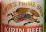

# yolov5_Beer_Logo_Detection

ビールメーカーのロゴをYOLOv5を使って検出するWEBアプリです。

キリンビールの麒麟とアサヒビールのAsahiを対象としています。

### 必要なライブラリについて
requirements.txtに記載されているYOLOv5の実行に必要なライブラリに加え、Flaskが必要です。

### 実行について
Anaconda Prompt等からapp.pyを引数無しで実行してください。

なお、クラス判定の閾値は0.5に設定しています。

(image_process.pyの38行目のconf_thresで変更可能です。)

### 学習用データセット(01.training_dataset)について
YOLOv5自体に「albumentations」を使った画像水増しが存在しますが、ローカルで画像水増ししました。

「albumentations」を使って回転(RandomRotate)と切り出し(RandomSizedCrop)を行い、

４倍(65枚→260)に増やしています。

また、全体の40％に対してGridMaskを行っています。

なお、画像サイズは640*640にリサイズしています。

### モデルについて
YOLOv5sをベースに学習させたモデルがbest_beer_yolov5s.pt、

YOLOv5mをベースに学習させたモデルがbest_beer_yolov5m.ptです。

(image_process.pyの35行目でモデルの変更が可能です。)

### その他
動画ファイルも対応しています。
